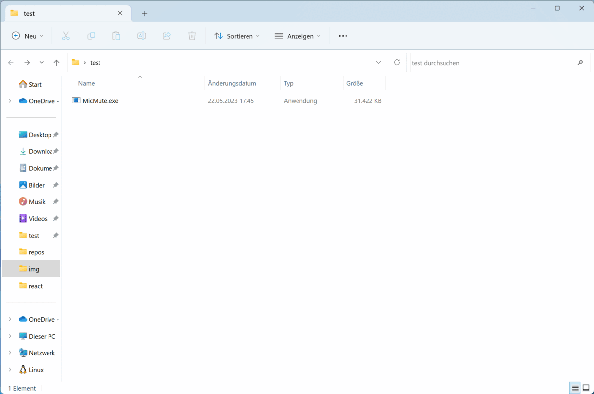

# MicMute App
Check out the website at: https://mic.vprobst.de

## How To Use
- compile it yourself using dotnet or download the latest Release: [MicMute.exe](https://github.com/vincepr/MicMute/releases/tag/v0.8)
- then open the folder in your Terminal.
- `.\MicMute.exe` for default settings.
- `.\MicMute.exe name=james pw=bond` with custom name and pw.



## About

Goal of this project was to enable remote controlling the microphone of the target computer. Controlled Signals from the Website hosted by [micmute_server](https://github.com/vincepr/go_micmute_server).

In a setting where the whole room shares one Room-Microphone in a Teams-Setting everyone could remote Mute-Toggle the microphone. Enabling a shared Microphone for convenient use, while keeping background noise low.

Infos about the app.
- only works with Windows (both x86 and x64)
- uses [WM_APPCOMMAND](https://learn.microsoft.com/en-us/windows/win32/inputdev/wm-appcommand)
    - So it sends a basic Signal for Volume_Up, Volume_Down, Volume_Toggle, MicVolume_Up, MicVolume_Down, MicVolume_Toggle to the foreground Window.
    - A Limitation is no Successs can be confirmed and no Status about current Volume or Toggle-status.
- It will not send any information back to the server, other than pings to keep the connection alive.

## Flags for custom Settings:
### the username and password
- default are `--user=bob` and `pw=123`
- if name is already in use by App will try to append 3 random letters to username.
```
--user=bob
--pw=ross
```
### Change max connection attempts
- If Conncetion fails, The App will try to reconnect, till the number is reached.
- `--count=0` for infinite attempts (default is `0`)
```
--count=10
```

### when selfhosting the server
if selfhosting the [micmute_server](https://github.com/vincepr/go_micmute_server) it might be neccesary to change url, https etc.
- set http mode (default is with `--https=true`)
```
--https=false
``` 

- change url or ip (default the website `mic.vprobst.de`)
```
--url=0.0.0.0:8080
--url=123.111.222.231:80
``` 

- set http mode (default is `true`)
```
--https=false
``` 

- set your custom apikey,used to authentificate on the server (default is `noauth`). 
```
--api=lkasdf012-38rjhy87dcfa8sdf-32f98asdff324
```

